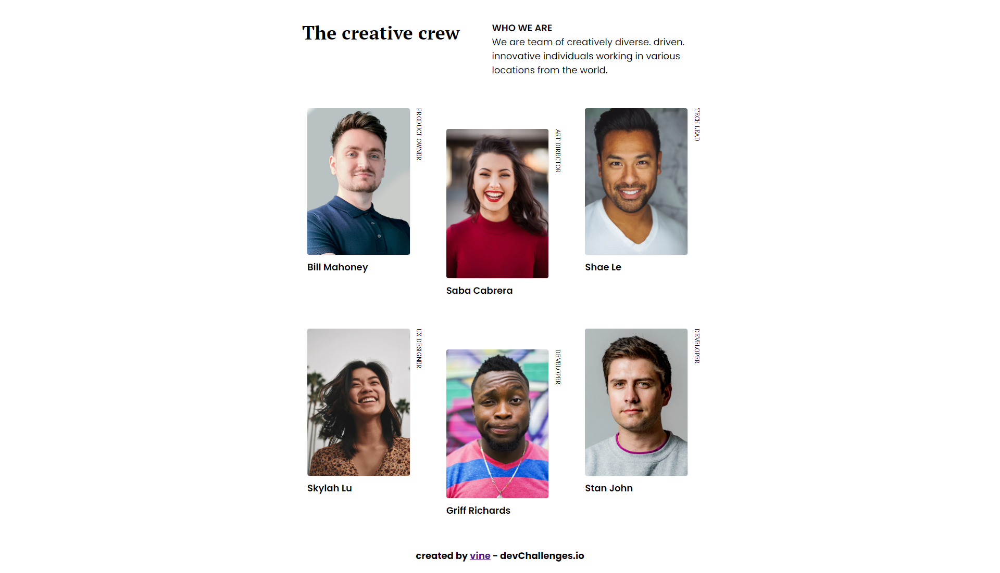
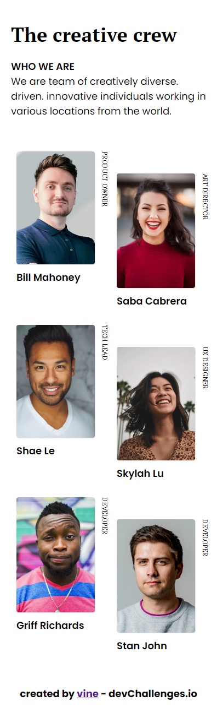

<!-- Please update value in the {}  -->

<h1 align="center">MY TEAM PAGE</h1>

   Solution for a challenge from  <a href="http://devchallenges.io" target="_blank">Devchallenges.io</a>.

    <a href="https://vinepereira.github.io/My-Team-Page-Dev-Challenges//">
      Solution
    </a>
     | 
    <a href="https://www.figma.com/file/F8d1qJsorEdY47N74HLxQ4/team-page-challenge?node-id=1%3A40&t=Ei6WB47ARDJ3tKF3-0">
      Challenge
    </a>
  </h3>

## Overview
<h1 align="center">Desktop</h1>

<h1 align="center">Mobile</h1>

### Built With

- HTML
- CSS

## Features

- This application/site was created as a submission to a [DevChallenges](https://devchallenges.io/challenges) challenge. The [challenge](https://devchallenges.io/challenges/wBunSb7FPrIepJZAg0sY) was to build an application to complete the given user stories.
- Responsive using display grid
- An animation was also inserted into the image.
- I learned how to use vertically oriented text

## Contact
- GitHub [@vinepereira](https://github.com/vinepereira)

